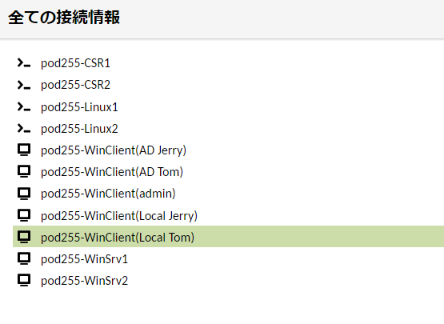
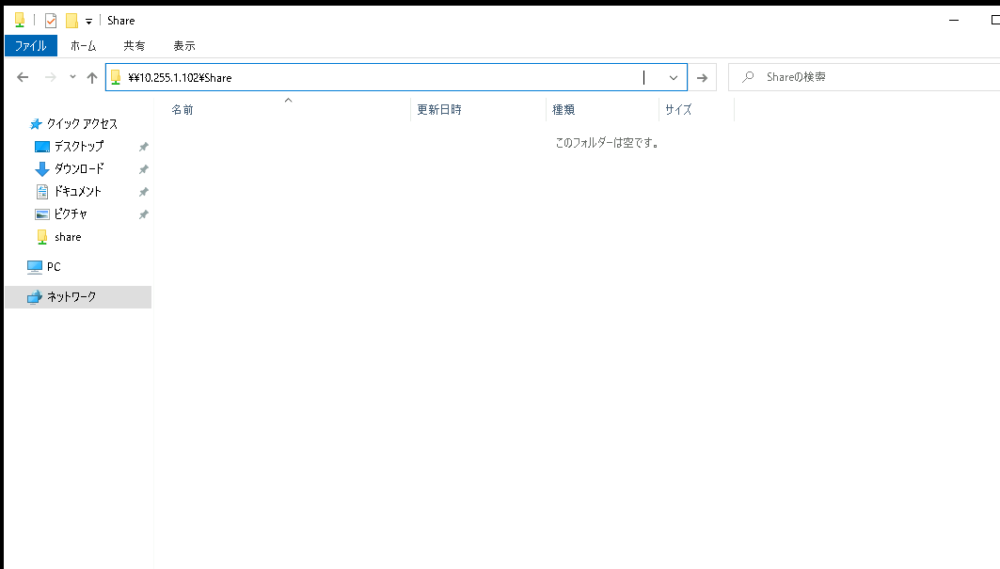
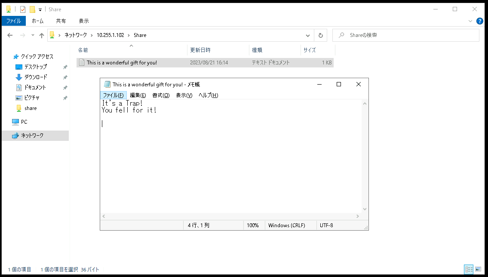
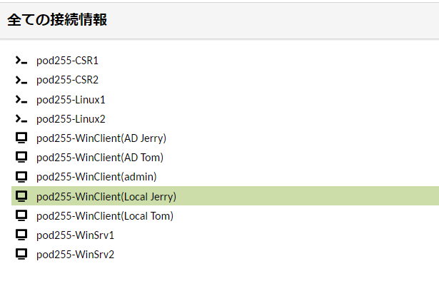
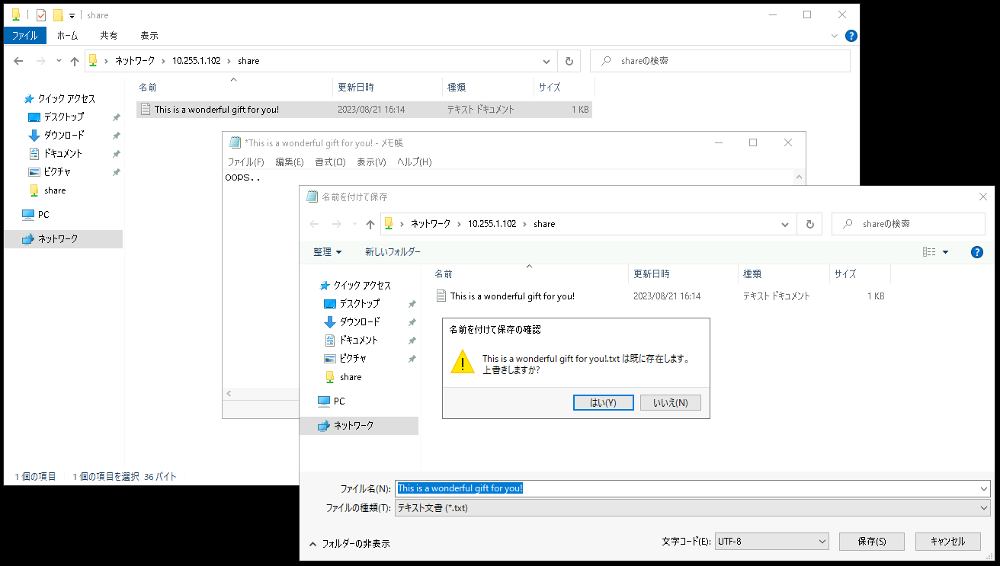
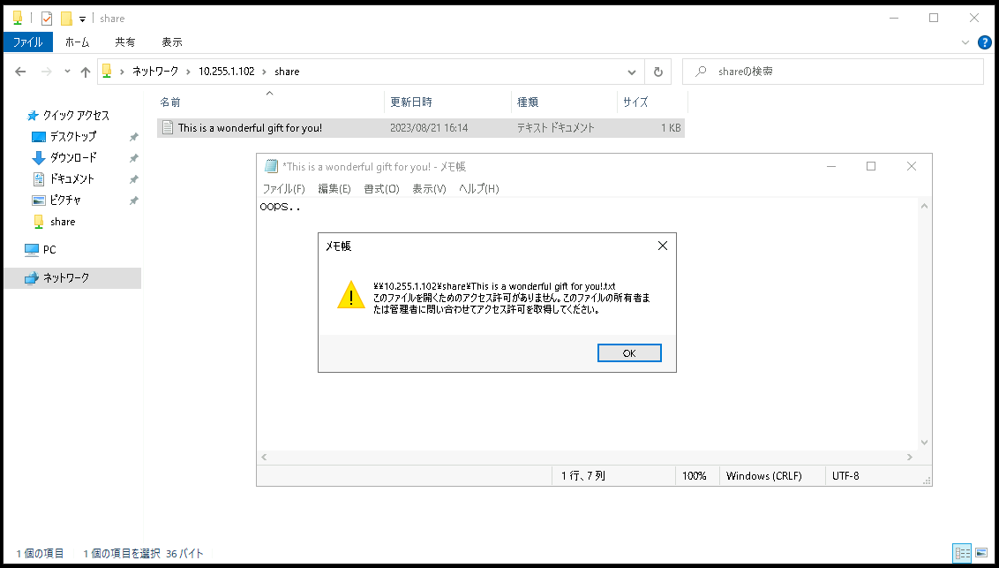

# Linux Serverでファイルサーバーを構築する
---

## シナリオ
この演習では、Linux Serverでファイルサーバーを構築する手順を学習します。   


"/share" フォルダを作成し、クライアントからアクセス可能な共有フォルダとしてネットワークに公開します。  
ファイルサービスを提供するソフトウェアとしては、Samba(samba.x86_64 0:4.10.16-24.el7_9)を使用します。  

共有フォルダにアクセスするユーザーアカウントとして"Tom"と"Jerry"を作成し、Sambaユーザーデータベースに登録することで、WindowsクライアントからLinuxのファイルサーバーにアクセスできます。

ファイルサーバーの動作確認として、Clientから共有フォルダにアクセスしてファイルの読み書きをテストします。  


## 演習における役割と、環境のパラメータ
- X: ご自身のPod番号
- Linuxファイルサーバー役: Linux1  
- クライアント デスクトップ環境: WinClient(WC1-yyMMddX)


## 注意
- 手順例の画像は<B>pod255</B>に準拠したパラメータのものです
- 手順内の<B>X</B>表記はご自身のpod番号に読み替えてください

---

<!--
## SELinuxを無効化する
1. SELinuxの状態を確認する
    ＞ ***sestatus***  
    

    > 【確認ポイント】
    > 'Current Mode:'が'enforcing'であることを確認する  
    > 'Mode from config file:'が'enforcing'であることを確認する  
    > 


1. SELinuxをOS起動時に無効にする  
    ＞ ***sudo cp /etc/selinux/config /etc/selinux/config.bak***   
    ＞ ***sudo vi /etc/selinux/config***  
    ＞ ***diff /etc/selinux/config /etc/selinux/config.bak***   

    ```
    [admin@linux1 ~]$ diff /etc/selinux/config /etc/selinux/config.bak
    7c7
    < SELINUX=disabled
    ---
    > SELINUX=enforcing
    [admin@linux1 ~]$   
    ```

1. SELinuxを一時的に無効にする   
    ＞ ***sudo setenforce 0***   

1. SELinuxの状態を確認する  
    ＞ ***sestatus***  

    > 【確認ポイント】
    > 'Current Mode:'が'permissive'であることを確認する  
    > 'Mode from config file:'が'disabled'であることを確認する  

---  
-->


## フォルダ(/share)を作成する  

1. ルート直下にshareフォルダを作成する  
    ＞ ***sudo mkdir /share***  

1. '/share'のパーミッションを変更する  

    1. 変更前の '/share' のパーミッションを確認する  
        ＞ ***ls -al /***  

    > 【確認ポイント】  
    > '/share' のパーミッションが 'drwxr-xr-x' であることを確認する   
    
    - [x] 一般ユーザ(Others)が書き込み権限(w)を持っていないこと  

    > 【補足】  
    > Linuxのパーミッションは以下の表記順序です。  
    > 所有者のrwx  
    > 所有グループのrwx  
    > Other(一般ユーザー)のrwx  
    
    > それぞれのアルファベット表記は、以下の意味です。  
    > r Read  
    > w Write  
    > x eXecute  


    1. '/share' のパーミッションを変更し、Userに書き込み権限を与える  
        ＞ ***sudo chmod o+w /share***  

    1. 変更後の '/share' のパーミッションを確認する  
        ＞ ***ls -al /***  

    > 【確認ポイント】  
    > '/share' のパーミッションが 'drwxr-xrwx' であることを確認する    

    - [x] 一般ユーザ(Others)が書き込み権限(w)を有すること  

---  

## ユーザー(TomとJerry)を作成する 

1. 'Tom'を作成する
    ＞ ***sudo useradd Tom***  
    ＞ ***sudo passwd Tom***  
    ＞ Changing password for user Tom.  
    ＞ New password: ***＜パスワード 'Pa\$\$w0rd' を入力する＞***  
    ＞ BAD PASSWORD: The password is shorter than 9 characters   
    ＞ Retype new password: ***＜パスワード 'Pa\$\$w0rd' を入力する＞***  
    ＞ passwd: all authentication tokens updated successfully.   

    > 【補足】
    > 'BAD PASSWORD'の警告は無視してください。

1. 作成した'Tom'でログインできることを確認する  
    ＞ ***su - Tom***  
    ＞ Password: ***＜パスワード 'Pa\$\$w0rd' を入力する＞***   
    ＞ ***whoami***  
    ＞ ***exit***  

    ```
    [admin@linux1 ~]$ su - Tom  
    Password:   
    Last login: Thu Aug 17 07:23:06 UTC 2023 on pts/0  
    [Tom@linux1 ~]$ whoami  
    Tom  
    [Tom@linux1 ~]$ exit  
    logout  
    [admin@linux1 ~]$   
    ```

1. 'Jerry'を作成する  
    ＞ ***sudo useradd Jerry***  
    ＞ ***sudo passwd Jerry***  
    ＞ Changing password for user Jerry.  
    ＞ New password: ***＜パスワード 'Pa\$\$w0rd' を入力する＞***  
    ＞ BAD PASSWORD: The password is shorter than 9 characters   
    ＞ Retype new password: ***＜パスワード 'Pa\$\$w0rd' を入力する＞***  
    ＞ passwd: all authentication tokens updated successfully.   

    > 【補足】
    > 'BAD PASSWORD'の警告は無視してください。

1. 作成した'Jerry'でログインできることを確認する  
    ＞ ***su - Jerry***  
    ＞ Password: ***＜パスワード 'Pa\$\$w0rd' を入力する＞***   
    ＞ ***whoami***  
    ＞ ***exit***  

    ```
    [admin@linux1 ~]$ su - Jerry  
    Password:   
    Last login: Thu Aug 17 07:23:06 UTC 2023 on pts/0  
    [Jerry@linux1 ~]$ whoami  
    Jerry  
    [Jerry@linux1 ~]$ exit  
    logout  
    [admin@linux1 ~]$   
    ```

---  

## Sambaをインストールする  

1. Sambaをインストールする  
    ＞ ***sudo  yum  -y  install  samba.x86_64  0:4.10.16-24.el7_9***  

1. インストールされたパッケージを確認する  
    ＞ ***yum list installed | grep samba***  

    > 【確認ポイント】  
    > 'samba.x86_64' が '4.10.16-24.el7_9' であることを確認する  

    > 【補足】  
    > '4.10.16-24.el7_9'よりも新しいバージョンがインストールされる場合がありますが、演習に支障はありません。  
    > そのまま演習を続けてください。

1. Samba(smb)サービスのStatusを確認する   
    ＞ ***systemctl status smb***  
 
    > 【確認ポイント】  
    > 'Active:' が 'inactive (dead)'であることを確認する  
    - [x] Samba(smb)が、サービスとして認識されていること  
    - [x] Samba(smb)サービスが、まだ起動していないこと  


---  

## Sambaユーザー(TomとJerry)を作成する

1. TomとJerryをSambaユーザーデータベース(passdb)に追加する  
    ＞ ***sudo pdbedit -a Tom***  
    ＞ new password: ＜'Pa\$\$w0rd' を入力する＞  
    ＞ retype new password: ＜'Pa\$\$w0rd' を入力する＞  
    ＞ ***sudo pdbedit -a Jerry***    
    ＞ new password: ＜'Pa\$\$w0rd' を入力する＞  
    ＞ retype new password: ＜'Pa\$\$w0rd' を入力する＞  


    ```
    [admin@linux1 ~]$ sudo pdbedit -a Tom
    new password:
    retype new password:
    Unix username:        Tom
    NT username:          
    Account Flags:        [U          ]
    User SID:             S-1-5-21-3168856064-4180914094-3528352746-1000
    Primary Group SID:    S-1-5-21-3168856064-4180914094-3528352746-513
    Full Name:            
    Home Directory:       \\linux1\tom
    HomeDir Drive:        
    Logon Script:         
    Profile Path:         \\linux1\tom\profile
    Domain:               LINUX1
    Account desc:         
    Workstations:         
    Munged dial:          
    Logon time:           0
    Logoff time:          Wed, 06 Feb 2036 15:06:39 UTC
    Kickoff time:         Wed, 06 Feb 2036 15:06:39 UTC
    Password last set:    Mon, 21 Aug 2023 04:49:44 UTC
    Password can change:  Mon, 21 Aug 2023 04:49:44 UTC
    Password must change: never
    Last bad password   : 0
    Bad password count  : 0
    Logon hours         : FFFFFFFFFFFFFFFFFFFFFFFFFFFFFFFFFFFFFFFFFF
    [admin@linux1 ~]$ 
    [admin@linux1 ~]$ sudo pdbedit -a Jerry
    new password:
    retype new password:
    Unix username:        Jerry
    NT username:          
    Account Flags:        [U          ]
    User SID:             S-1-5-21-3168856064-4180914094-3528352746-1001
    Primary Group SID:    S-1-5-21-3168856064-4180914094-3528352746-513
    Full Name:            
    Home Directory:       \\linux1\jerry
    HomeDir Drive:        
    Logon Script:         
    Profile Path:         \\linux1\jerry\profile
    Domain:               LINUX1
    Account desc:         
    Workstations:         
    Munged dial:          
    Logon time:           0
    Logoff time:          Wed, 06 Feb 2036 15:06:39 UTC
    Kickoff time:         Wed, 06 Feb 2036 15:06:39 UTC
    Password last set:    Mon, 21 Aug 2023 05:33:19 UTC
    Password can change:  Mon, 21 Aug 2023 05:33:19 UTC
    Password must change: never
    Last bad password   : 0
    Bad password count  : 0
    Logon hours         : FFFFFFFFFFFFFFFFFFFFFFFFFFFFFFFFFFFFFFFFFF
    [admin@linux1 ~]$ 

    ```

<!--
    > 【補足】  
    > Sambaユーザーデータベースに追加できるのは、作成済みのLinuxユーザーのみです。  
    > pdbeditコマンドを実行する前に、useraddコマンドでLinuxユーザーを作成してください。  

    ＞ [admin@linux1 ~]$ sudo pdbedit -a Jerry  
    ＞ new password:  
    ＞ retype new password:  
    ＞ Failed to add entry for user Jerry.  
    ＞ [admin@linux1 ~]$   
    ＞ 
    [admin@linux1 ~]$ sudo useradd Jerry  
    [admin@linux1 ~]$ sudo passwd Jerry  
    Changing password for user Jerry.  
    New password:   
    BAD PASSWORD: The password is shorter than 9 characters  
    Retype new password:   
    passwd: all authentication tokens updated successfully.  
    [admin@linux1 ~]$   
    [admin@linux1 ~]$ sudo pdbedit -a Jerry
    new password:
    retype new password:
    Unix username:        Jerry
    NT username:          
    Account Flags:        [U          ]
    User SID:             S-1-5-21-3168856064-4180914094-3528352746-1001
    Primary Group SID:    S-1-5-21-3168856064-4180914094-3528352746-513
    Full Name:            
    Home Directory:       \\linux1\jerry
    HomeDir Drive:        
    Logon Script:         
    Profile Path:         \\linux1\jerry\profile
    Domain:               LINUX1
    Account desc:         
    Workstations:         
    Munged dial:          
    Logon time:           0
    Logoff time:          Wed, 06 Feb 2036 15:06:39 UTC
    Kickoff time:         Wed, 06 Feb 2036 15:06:39 UTC
    Password last set:    Mon, 21 Aug 2023 05:33:19 UTC
    Password can change:  Mon, 21 Aug 2023 05:33:19 UTC
    Password must change: never
    Last bad password   : 0
    Bad password count  : 0
    Logon hours         : FFFFFFFFFFFFFFFFFFFFFFFFFFFFFFFFFFFFFFFFFF
    [admin@linux1 ~]$ 
-->


1. Sambaユーザーデータベースを参照し、TomとJerryが登録されていることを確認する  
    ＞ ***sudo pdbedit -L -v***  
    
    > 【確認ポイント】  
    > 'Tom'と'Jerry'の情報が表示されることを確認する 


---  

## Sambaをconfigする  
1. Samba(smb)のconfigファイルを編集し、ファイルサーバーとしての要件を実装する   
    ＞ ***sudo cp /etc/samba/smb.conf /etc/samba/smb.conf.bak***  
    ＞ ***sudo vi /etc/samba/smb.conf***  
    ＞ ***diff /etc/samba/smb.conf /etc/samba/smb.conf.bak***  

    【要件】  
    - [x] 共有名 'share' で '/share' ディレクトリを公開する  
    - [x] 読み書き可能な共有フォルダとしてアクセスを許可する  
    - [x] Tomは共有フォルダで読み書きができる  
    - [x] Jerryは共有フォルダに読み取りアクセスできるが、書き込みはできない  

    ```
    [admin@linux1 ~]$ diff /etc/samba/smb.conf /etc/samba/smb.conf.bak 
    38,43d37
    < 
    < [share]
    < path = /share
    < writable = Yes
    < read list = Jerry
    < 
    [admin@linux1 ~]$ 
    ```


    <details>
    <summary>[参考]smb.conf全文 (クリックで表示):</summary>  
 
        [admin@linux1 ~]$ cat /etc/samba/smb.conf
        # See smb.conf.example for a more detailed config file or
        # read the smb.conf manpage.
        # Run 'testparm' to verify the config is correct after
        # you modified it.

        [global]
        workgroup = SAMBA
        security = user

        passdb backend = tdbsam

        printing = cups
        printcap name = cups
        load printers = yes
        cups options = raw

        [homes]
        comment = Home Directories
        valid users = %S, %D%w%S
        browseable = No
        read only = No
        inherit acls = Yes

        [printers]
        comment = All Printers
        path = /var/tmp
        printable = Yes
        create mask = 0600
        browseable = No

        [print$]
        comment = Printer Drivers
        path = /var/lib/samba/drivers
        write list = @printadmin root
        force group = @printadmin
        create mask = 0664
        directory mask = 0775

        [share]
        path = /share
        writable = Yes
        read list = Jerry

        [admin@linux1 ~]$ 


    </details>


1. Samba(smb)サービスを自動起動に設定する  
    ＞ ***sudo systemctl enable smb***  
 
1. Samba(smb)サービスを起動する  
    ＞ ***sudo systemctl start smb***  

1. Samba(smb)サービスのStatusを確認する  
    ＞ ***systemctl status smb***  
 
    > 【確認ポイント】  
    > 'Active:' が 'active(running)'であることを確認する  
    - [x] Samba(smb)サービスが起動していること   

--- 

## Linuxファイルサーバーの動作を確認する


この演習では、WinClient(WC1)をクライアント デスクトップ環境と想定して、ファイルサーバーの動作確認に使用します。  
ファイルサーバーとクライアントデスクトップはワークグループ環境であるため、クライアントからファイルサーバーにアクセスするためには、それぞれのコンピュータに同じユーザー アカウントを作成する必要があります。  


1. Windows Clientに"Tom"で接続する  
    1. Windows Client(WinClient)の管理画面に "Tom" で接続する('Local Tom'と'AD Tom'がある場合は'Local Tom'を使用する)  
        <kbd></kbd> 
    1. [スタートメニュー]を右クリックし、コンテキストメニュー内の[Windows PowerShell]をクリックする('管理者'ではなく通常のPowerShellを起動する)  
    1. Windows PowerShellのウィンドウが表示されたことを確認する  
    1. 以下のコマンドを実行し、クライアント デスクトップ環境役のコンピュータ(WC1)に "Tom" で接続していることを確認する  
        ＞ ***hostname***  
        ＞ ***whoami***         

1. Tomでファイルサーバーにアクセスする  
    1. ファイルエクスプローラを起動し、アドレス欄ファイルサーバーのUNCパス(\\\\10.X.1.102\\Share)を入力してEnterキーを押下する            
    1. ファイルサーバーのShareフォルダにアクセスできることを確認する  
        <kbd></kbd> 
    1. Tomでファイルサーバーの動作テストを実行する  
        > 【動作テストの観点】  
        > TomはShareフォルダでファイルの読み書きができることを確認する  

        - [x] Shareフォルダに任意の名称のテキストファイルを作成できること  
        - [x] 作成したテキストファイルを開き、任意の文言を記入してファイルを保存できること  
        - [x] 保存されたファイルを開き、テキストファイルの中身を閲覧できること  

        <kbd></kbd> 

1. Windows Clientに"Jerry"で接続する  
    1. Windows Client(WinClient)の管理画面に "Jerry" で接続する('Local Jerry'と'AD Jerry'がある場合は'Local Jerry'を使用する)  
        <kbd></kbd>   
    1. [スタートメニュー]を右クリックし、コンテキストメニュー内の[Windows PowerShell]をクリックする('管理者'ではなく通常のPowerShellを起動する)  
    1. Windows PowerShellのウィンドウが表示されたことを確認する  
    1. 以下のコマンドを実行し、クライアント デスクトップ環境役のコンピュータ(WC1)に "Jerry" で接続していることを確認する  
        ＞ ***hostname***  
        ＞ ***whoami***         
 
1. Jerryでファイルサーバーにアクセスする  
    1. ファイルエクスプローラを起動し、アドレス欄ファイルサーバーのUNCパス(\\\\10.X.1.102\\Share)を入力してEnterキーを押下する      
    1. ファイルサーバーのShareフォルダにアクセスできることを確認する  
    1. Jerryでファイルサーバーの動作テストを実行する  

        <kbd></kbd>   
        <kbd></kbd>   
        > 【動作テストの観点】  
        > JerryはShareフォルダで、ファイルの読み取りはできるが、書き込みはできないことを確認する   

        - [x] Shareフォルダに新しいファイルを作成できないこと  
        - [x] Jerryは、Tomが作成したファイルの中身を閲覧できること   
        - [x] Jerryは、Tomが作成したファイルを変更した後、保存ができないこと  

---

## 演習完了  
ここまでの手順で、以下の項目を学習できました。
- [x] Linuxユーザーアカウントを作成する
- [x] LinuxでSambaサービスをインストールする  
- [x] Sambaのconfigファイルを編集して、アクセス権を設定する  

