# システム間連携と自動化  

---

## 演習における役割と、環境のパラメータ
- X: ご自身のPod番号  
- Router 1: CSR1
- Windowsタスクスケジューラ基盤: WinClient
- Linux cron基盤: Linux1
- File Server 1: WinSrv2
- File Server 2: Linux1  


## 注意
- 手順例の画像は<B>pod255</B>に準拠したパラメータのものです
- 手順内の<B>X</B>表記はご自身のpod番号に読み替えてください

---


# Router1でRESTCONFを有効化する

1. Router1(CSR1)に接続する  

1. Router1(CSR1)でRESTCONFを有効化する  

    1. Router1(CSR1)で以下のコマンドを実行し、RESTCONF接続用のユーザーアカウントを新規作成する      
        CSR1# ***conf t***  
        CSR1(config)# ***username automation privilege 15 password Pa$$w0rd***   

        ```
        CSR1(config)#username automation privilege 15 password Pa$$w0rd
        WARNING: Command has been added to the configuration using a type 0 password. However, type 0 passwords will soon be deprecated. Migrate to a supported password type
        CSR1(config)#
        ```

    1. Router1(CSR1)で以下のコマンドを実行し、RESTCONFのHTTPS通信を有効化する        
        CSR1(config)# ***ip http secure-server***   

        ```
        CSR1(config)#ip http secure-server
        ```
        
        > 【補足】
        >  このバージョンのIOS-XEルーターは、ip http secure-serverの設定が既定で有効化されています。  
        > この演習手順においては、学習目的でコマンドを明示的に入力します。  

    1. Router1(CSR1)で以下のコマンドを実行し、RESTCONF機能を有効化する        
        CSR1(config)# ***restconf***   

        ```
        CSR1(config)#restconf 
        CSR1(config)#
        ```


1. Router1(CSR1)で以下のコマンドを実行し、configを保存する          
    CSR1(config)# ***end***   
    CSR1# ***write*** 


<!--
【補足】  
RESTCONFの構成方法の詳細は、Ciscoのドキュメントを参照してください。  
https://www.cisco.com/c/ja_jp/td/docs/ios-xml/ios/prog/configuration/1612/b_1612_programmability_cg/restconf_programmable_interface.pdf
-->


---  

# Linux1のcronでRouter1の情報を取得する  

1. Linux1に接続する  

1. Linux1でRESTCONFを実行するスクリプトを作成する  

    1. Linux1で以下のコマンドを実行し、get_restconf_data.sh ファイルを作成する  
        ＞ ***touch get_restconfdata.sh***   

        ```
        [admin@linux1 ~]$ touch get_restconfdata.sh
        ```

    1. Linux1で以下のコマンドを実行し、get_restconf_data.sh ファイルに実行可能権限を追加する    
        ＞ ***chmod +x get_restconfdata.sh***   
        ＞ ***ls -l get_restconfdata.sh***   

        ```
        [admin@linux1 ~]$ chmod +x get_restconfdata.sh 
        [admin@linux1 ~]$ ls -l get_restconfdata.sh 
        -rwxrwxr-x 1 admin admin 0 Feb 28 08:03 get_restconfdata.sh
        [admin@linux1 ~]$ 
        ```

        > 【補足】  
        > lsコマンド出力の行頭部分はそのファイルのパーミッション(権限)を表します。
        > 'x' は実行可能(eXecute)権限が与えられていることを意味します。  

    1. Linux1で以下のコマンドを実行し、get_restconf_data.sh ファイルにRESTCONF実行コマンドを記述します。      
        ＞ ***vi get_restconfdata.sh***   
        ＞ ***cat get_restconfdata.sh***   

        ```
        [admin@linux1 ~]$ vi get_restconfdata.sh 
        [admin@linux1 ~]$ cat get_restconfdata.sh 
        curl -u automation:Pa\$\$w0rd -k -H "Content-Type: application/yang-data+json" https://10.X.1.254/restconf/data/Cisco-IOS-XE-native:native/ -o /share/restconfdata.txt 

        [admin@linux1 ~]$ 
        ```

        > 【補足】  
        > curlはHTTPメッセージを送信するコマンドツールです。  
        > Router1のRESTCONFのURIにHTTPリクエストを送信し、JSON形式のレスポンスを受信して/share/restconfdata.txtに保存しています。  

        > 【補足】  
        > スクリプトの手入力が難しい場合は、コピー&貼りつけで作業を進めてください。  
        > [Ctrl] + [Alt] + [Shift] でクリップボードを編集し、右クリックでLinuxコマンドラインに文字列を貼りつけできます。 
        > なお、Router1のIPアドレスのXは自身のPod番号の表記に書き換えてください。   


1. スクリプト単体の動作を確認する    

    1. Linux1で以下のコマンドを実行し、get_restconf_data.sh によってRESTCONFでRouter1の情報を取得できることを確認する    
        ＞ ***./get_restconfdata.sh***   
        ＞ ***cat /share/restconfdata.txt***   

        ```
        [admin@linux1 ~]$ ./get_restconfdata.sh 
        % Total    % Received % Xferd  Average Speed   Time    Time     Time  Current
                                        Dload  Upload   Total   Spent    Left  Speed
        100 11356    0 11356    0     0   7892      0 --:--:--  0:00:01 --:--:--  7897
        [admin@linux1 ~]$ 
        [admin@linux1 ~]$ cat /share/restconfdata.txt 
        {
        "Cisco-IOS-XE-native:native": {
            "version": "17.3",
            "boot-start-marker": [null],
            "boot-end-marker": [null],
            "memory": {
            "free": {
                "low-watermark": {
                "processor": 71489
                }
            }
    
            (略)

        [admin@linux1 ~]$
        ```

    1. Linux1で以下のコマンドを実行し、動作確認で出力された/share/restconfdata.txtを削除する   
        ＞ ***rm /share/restconfdata.txt***    
        ＞ ***cat /share/restconfdata.txt ***  

        ```
        [admin@linux1 ~]$ rm /share/restconfdata.txt 
        [admin@linux1 ~]$ cat /share/restconfdata.txt 
        cat: /share/restconfdata.txt: No such file or directory
        [admin@linux1 ~]$ 
        ```

1. cronを構成する

    1. Linux1で以下のコマンドを実行し、cron tableファイルの編集を開始する    
        ＞ ***crontab -e***   

    1. 以下の文言を記入する

        `* * * * * /home/admin/get_restconfdata.sh`  

        > 【補足】  
        > crontabのエディタの操作方法は、viと同じです。  
        > [i]キーでインサートモードを開始し、[Esc]キーでコマンドモードに戻ります。  
        > コマンドモードで[:wq]と入力することで、編集内容を保存して終了します。  

        > 【補足】  
        > crontabのエントリの表記は、以下の意味となり、指定された日時にコマンドが自動実行されます。
        > 分 時 日 月 曜日 <実行するコマンド>
        > 
        > 日時を指定するパラメータとして通常は数字を記述しますが、anyを意味する記号として*を記述できます。
        > `* * * * *` の指定は1分ごとにコマンドを実行するという動作になります。  

    1. Linux1で以下のコマンドを実行し、cron tableファイルの中身を確認する      
        ＞ ***crontab -l***   

        ```
        [admin@linux1 ~]$ crontab -l
        * * * * * /home/admin/get_restconfdata.sh
        [admin@linux1 ~]$ 
        ```


1. Router1の設定が自動的に取得されていることを確認する  

    1. Linux1で以下のコマンドを60秒間隔で複数回実行し、/share/restconfdata.txt のタイムスタンプが1分ごとに更新されていることを確認する     
        ＞ ***ls -l /share/***   
        ＞ ***ls -l /share/***   
        ＞ ***ls -l /share/***   

        ```
        [admin@linux1 ~]$ ls -l /share/
        total 16
        -rw-r--r-- 1 admin admin 11356 Feb 28 15:03 restconfdata.txt
        -rwxr--r-- 1 Tom   Tom      36 Aug 21  2023 This is a wonderful gift for you!.txt
        [admin@linux1 ~]$ 
        You have new mail in /var/spool/mail/admin
        [admin@linux1 ~]$ ls -l /share/
        total 16
        -rw-r--r-- 1 admin admin 11356 Feb 28 15:04 restconfdata.txt
        -rwxr--r-- 1 Tom   Tom      36 Aug 21  2023 This is a wonderful gift for you!.txt
        [admin@linux1 ~]$ 
        You have new mail in /var/spool/mail/admin
        [admin@linux1 ~]$ ls -l /share/
        total 16
        -rw-r--r-- 1 admin admin 11356 Feb 28 15:05 restconfdata.txt
        -rwxr--r-- 1 Tom   Tom      36 Aug 21  2023 This is a wonderful gift for you!.txt
        [admin@linux1 ~]$ 
        ```


---  

# Router1でWindows Server 2のWebサービスを監視する  

1. Windows Server 2に監視対象のWebサイトを準備する  
    1. Windows Server 2(WinSrv2)に接続する  
    1. IIS管理コンソールを起動する  
    1. [サイト]を右クリックし、[新しいサイトの追加]をクリックする  
        <kbd>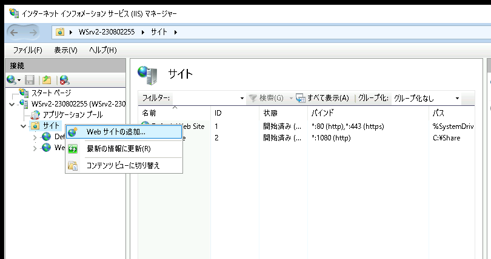</kbd>
    1. [Webサイトの追加]ウィンドウが表示されたことを確認する  
    1. 以下のパラメータを入力する

        | 項目 | パラメータ |
        | :----- | :----- |
        | サイト名 | monitor |
        | アプリケーション プール | <既定値> |
        | 物理パス | C:\\inetpub\\wwwroot\\ |  
        | 種類 | http |
        | IPアドレス | 未使用のIPアドレスすべて |  
        | ポート | 8080 |  
        | ホスト名 | <空欄> |  
        - [x] Webサイトを直ちに開始する  

        <kbd>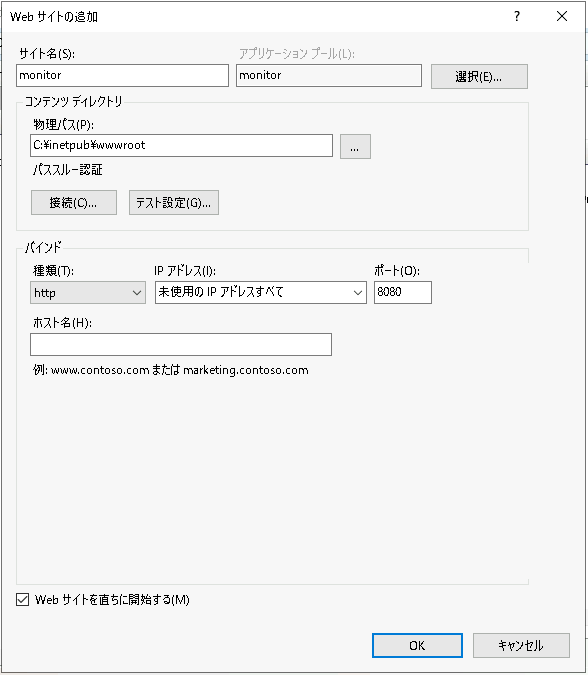</kbd>

    1. [OK]をクリックする  

    1. [monitor]サイトが追加されていることを確認する  
        <kbd>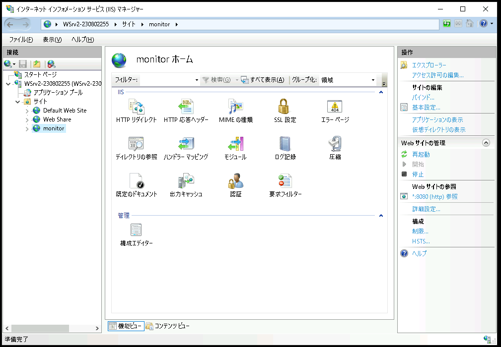</kbd>
    
    1. Webブラウザを起動し、作成したmonitorサイトに接続して、Webサイトが起動していることを確認する  

        | URL | `http://10.X.2.105:8080/` |
        | :----- | :----- |

        <kbd></kbd>

<!--
【補足】  
Router 1に構成するconfigと表記をそろえるため、WebブラウザのアクセスにおいてもIPアドレスを指定している。  
DNS名でアクセスしても問題ない。  
-->


1. Router1(CSR1)に接続する  

1. Router1(CSR1)でIP SLAを作成する

    1. Router1(CSR1)で以下のコマンドを実行し、60秒ごとにmonitorサイトの接続性を監視するIP SLAを作成する         
        CSR1# ***conf t***     
        CSR1(config)# ***ip sla 1***  
        CSR1(config-ip-sla)# ***http get http://10.X.2.105:8080/***   
        CSR1(config-ip-sla-http)# ***frequency 60***  
        CSR1(config-ip-sla-http)#exit  

        ```
        CSR1#conf t
        Enter configuration commands, one per line.  End with CNTL/Z.
        CSR1(config)#ip sla 1
        CSR1(config-ip-sla)#http get http://10.255.2.105:8080/
        CSR1(config-ip-sla-http)#frequency 60
        CSR1(config-ip-sla-http)#exit
        CSR1(config)#  
        ```

    1. Router1(CSR1)で以下のコマンドを実行し、IP SLAによる監視を開始する  
        CSR1(config)# ***ip sla schedule 1 start-time now life forever***   

        ```
        CSR1(config)#ip sla schedule 1 start-time now life  forever 
        CSR1(config)#
        ```

    1. Router1(CSR1)で以下のコマンドを実行し、IP SLAによる監視結果を確認する  
        CSR1(config)# ***end***  
        CSR1# ***show ip sla statistics 1***  

        ```
        CSR1(config)#end
        CSR1#show ip sla statistics 1
        IPSLAs Latest Operation Statistics

        IPSLA operation id: 1
        Latest RTT: 5 milliseconds
        Latest operation start time: 15:39:54 UTC Wed Feb 28 2024
        Latest operation return code: OK
        Latest DNS RTT: 0 ms
        Latest TCP Connection RTT: 3 ms
        Latest HTTP Transaction RTT: 2 ms
        Number of successes: 9
        Number of failures: 0
        Operation time to live: Forever

        CSR1#
        ```

        > 【確認ポイント】
        > "Latest operation return code: OK"であることを確認する  

1. Router1(CSR1)でTrackを作成する  

    1. Router1(CSR1)で以下のコマンドを実行し、IP SLAの結果を判定するTrackオブジェクトを作成する  
        CSR1# ***conf t***   
        CSR1(config)# ***track 10 ip sla 1 reachability***  
        CSR1(config-track)# ***end***     

        ```
        CSR1#conf t
        Enter configuration commands, one per line.  End with CNTL/Z.
        CSR1(config)#track 10 ip sla 1 reachability
        CSR1(config-track)#exit
        CSR1(config)#
        ```

        > 【補足】  
        > コマンド内のパラメータの数字は、それぞれのオブジェクトの識別子(ID)です。
        >  ID 10 のTrackオブジェクトを定義し、ID 1 の IP SLAの結果を追跡してUp/Downを判定します。  

    1. Router1(CSR1)で以下のコマンドを実行し、Trackオブジェクトの状態を確認する  
        CSR1(config)# ***end***  
        CSR1# ***show track 10***  


        ```
        CSR1(config)#end 
        CSR1#show track 10
        Track 10
        IP SLA 1 reachability
        Reachability is Up
            1 change, last change 00:04:24
        Latest operation return code: OK
        Latest RTT (millisecs) 4
        CSR1#
        ```

        > 【補足】  
        > "Reachability is Up" であることを確認する  


1. Router1(CSR1)でEEMを作成する  

    1. Router1(CSR1)で以下のコマンドを実行し、TrackがDown判定をした際に自動実行されるEEMを作成する   
        CSR1# ***conf t***   
        CSR1(config)# ***event manager applet MONITORWEB***   
        CSR1(config-applet)# ***event track 10 state down***     

        ```
        CSR1#conf t
        Enter configuration commands, one per line.  End with CNTL/Z.
        CSR1(config)#event manager applet MONITORWEB
        CSR1(config-applet)#event track 10 state down
        ```

    1. EEMの処理内容(action)として、Syslogにメッセージを出力させる    
        CSR1(config-applet)# ***action 1.0 syslog msg "web server is down"***     

        ```
        CSR1(config-applet)#action 1.0 syslog msg "web server is down" 
        ```


    1. EEMの処理内容(action)として、Linux1に通知(webhook)を送信させる処理を追加する      
        CSR1(config-applet)# ***action 2.0 cli command "enable"***  
        CSR1(config-applet)# ***action 3.0 cli command "guestshell run curl -X post http://10.X.1.102:8080/notify"***  

        ```
        CSR1(config-applet)#action 2.0 cli command "enable"
        CSR1(config-applet)#action 3.0 cli command "guestshell run curl -X post http://10.255.1.102:8080/notify"
        ```

        > 【補足】  
        > guestshell runはGuestShellのLinuxコマンドを実行できるIOSコマンドです。  
        > Linuxのcurlコマンドを使用して、HTTPメッセージを送信します。  

        > 【補足】   
        > EEMのCLIアクションの開始時はユーザーモードの状態です。   
        > enableコマンドを実行して、特権モードにログインする必要があります。  

        > 【補足】
        > Dockerコンテナで実行されるWebアプリケーションを宛先としたHTTPメッセージを送信します。
        > このWebアプリケーションにリクエストを送信すると、Linux1の/share/にnotifyというファイルを作成します。  

<!--
【補足】
event manager appletのconfigは、更新をしてから実際に反映されるまでのタイムラグが生じる場合があります。
show run | sec event managerの結果を信用してはいけません。
動作に怪しさを感じた際は、デバイスを再起動してからconfigを再確認してください。
演習の進行においては、別の名前のappletを作成しても問題ありません。
-->

<!--
【補足】
EEM動作検証に役立つコマンドを紹介します。  

EEMを手動で実行する (ただし、event none のみ)
event manager run EEM名 

debugを出力する
debug event manager action cli

参考: https://www.cisco.com/c/ja_jp/support/docs/ios-nx-os-software/ios-xe-16/217013-troubleshoot-and-test-eem-scripts.html
-->


1. Router1(CSR1)で以下のコマンドを実行し、NATを実行するインターフェイスを指定する  
    CSR1(config)# ***interface GigabitEthernet 1***  
    CSR1(config-if)# ***ip nat outside***  
    CSR1(config-if)# ***exit***       

    ```
    CSR1(config)#interface GigabitEthernet 1
    CSR1(config-if)#ip nat outside
    CSR1(config-if)#exit
    ```

    > 【補足】  
    > ネットワークの実用構成のNAT演習の際に、GigabitEthernet 1 にip nat insideを設定していますが、insideの設定はGuestShellとLinux1の間の通信を妨げるためoutsideの設定にします。  


---  

# Linux1のDockerコンテナを起動する

1. Linux1に接続する  

1. Linux1で以下のコマンドを実行し、Dockerコンテナの状態を確認する  
    ＞ ***docker ps***   

    ```
    [admin@linux1 ~]$ docker ps
    CONTAINER ID   IMAGE          COMMAND                  CREATED        STATUS       PORTS                                   NAMES
    3c44d1f3e8a7   my-image:1.0   "/bin/sh -c 'pipenv …"   45 hours ago   Up 2 hours   0.0.0.0:8080->80/tcp, :::8080->80/tcp   dazzling_goldberg
    [admin@linux1 ~]$ 
    ```

    > 【確認ポイント】  
    > IMAGE が "my-image:1.0" のコンテナの STATUS が "Up" であることを確認する  

    > 【補足】  
    >  docker ps は起動状態のコンテナの一覧を表示するコマンドです。  
    > このコマンドの出力が得られない場合は、コンテナが起動されていないことを意味します。  
    > 次の項目のコマンドを実行し、コンテナを起動してください。

1. (コンテナが起動していない場合のみ実施) Linux1でDockerコンテナを起動し、Webアプリケーションを実行する    

    1. Linux1で以下のコマンドを実行し、dockerコンテナのIDを確認する  
        ＞ ***docker ps -a***   


        [admin@linux1 ~]$ docker ps -a
        CONTAINER ID   IMAGE                COMMAND                  CREATED        STATUS                      PORTS                                   NAMES
        3c44d1f3e8a7   my-image:1.1         "/bin/sh -c 'pipenv …"   45 hours ago   Exited                                                              crazy_edison
        [admin@linux1 ~]$ 

        > 【確認ポイント】  
        > CONTAINER IDの値を次のコマンドで使用します。  

        > 【補足】  
        >  docker ps -aは停止状態のコンテナも含めて、すべてのコンテナの一覧を表示するコマンドです。  

    1. Linux1で以下のコマンドを実行し、dockerコンテナを起動する  
        ＞ ***docker start <コンテナID>***   

        ```
        [admin@linux1 ~]$ docker start 3c44d1f3e8a7
        3c44d1f3e8a7
        [admin@linux1 ~]$ 
        ```

    1. Linux1で以下のコマンドを実行し、Dockerコンテナの状態を確認する
        ＞ ***docker ps***   

        ```
        [admin@linux1 ~]$ docker ps
        CONTAINER ID   IMAGE          COMMAND                  CREATED        STATUS       PORTS                                   NAMES
        3c44d1f3e8a7   my-image:1.0   "/bin/sh -c 'pipenv …"   45 hours ago   Up About a minute   0.0.0.0:8080->80/tcp, :::8080->80/tcp   dazzling_goldberg
        [admin@linux1 ~]$ 
        ```

        > 【確認ポイント】  
        > IMAGE が "my-image:1.0" のコンテナの STATUS が "Up" であることを確認する  


---  

# Windows ClientからWindows Server2のリモート制御を許可する  

1. Windows Server 2でリモート管理を有効化する  

    1. Windows Server 2(WinSrv2)に接続する  
    1. PowerShell(管理者)を起動し、以下のコマンドを実行する  
        `Enable-PsRemoting -Force -SkipNetworkProfileCheck`  

        ```
        PS C:\Windows\system32> Enable-PSRemoting -Force -SkipNetworkProfileCheck
        PS C:\Windows\system32>
        ```

1. Windows Clientでリモート管理を有効化する  

    1. Windows Client(WinClient)に "AD Tom" で接続する  
    1. PowerShell(管理者)を起動し、以下のコマンドを実行する  
        `Set-Item WSMan:\localhost\Client\TrustedHosts -Value * -Force`  

        ```
        PS C:\Windows\system32> Set-Item WSMan:\localhost\Client\TrustedHosts -Value * -Force
        PS C:\Windows\system32>
        ```

1. Windows ClientからWindows Server 2にhostnameコマンドを送信できることを確認する  

    1. Windows Client(WinClient)に "AD Tom" で接続する   

        > 【補足】   
        > 誤って "admin" でログインすることないように注意してください。   
        > この項目の手順は "AD Tom" を使用します  

    1. PowerShell(管理者)を起動し、以下のコマンドを実行する    
        `$Credential = New-Object System.Management.Automation.PSCredential('spike', (ConvertTo-SecureString -String 'Pa$$w0rd' -AsPlainText -Force))`    
        `Invoke-Command -ComputerName web1.example.local -ScriptBlock {hostname} -Credential $Credential`    

        ```
        PS C:\Windows\system32> $Credential = New-Object System.Management.Automation.PSCredential('spike', (ConvertTo-SecureString -String 'Pa$$w0rd' -AsPlainText -Force))
        PS C:\Windows\system32> Invoke-Command -ComputerName web1.example.local -ScriptBlock {hostname} -Credential $Credential
        WSrv2-230802255
        ```

        > 【補足】  
        > コマンドの手入力が難しい場合は、コピー&貼りつけで作業を進めてください。   
        > [Ctrl] + [Alt] + [Shift] でクリップボードを編集し、右クリックでLinuxコマンドラインに文字列を貼りつけできます。  

        > 【確認ポイント】】  
        > Windows ClientのPowerShellで入力されたhostnameコマンドが、Windows Server 2で実行され、結果がWindows ClientのPowerShellに返されています。   
        > Windows ClientからWindows Server2のリモート制御ができる状態であることを確認します。  


---  

# Linux1のnotifyファイルの有無を監視するPowerShellスクリプトを作成する  

1. Windows Clientでスクリプトファイル(ps1)を作成する  

    1. Windows Client(WinClient)に "AD Tom" で接続する  
    1. 新しいフォルダを作成する  
        `C:\scripts\`  

        <kbd>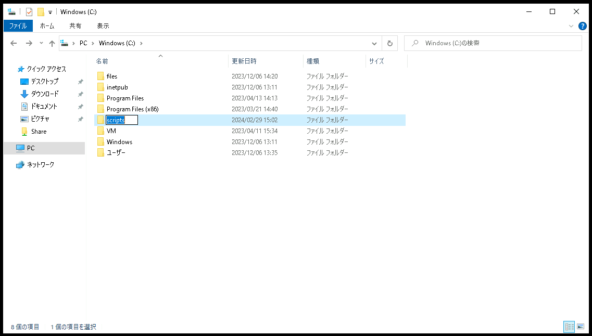</kbd>

    1. Windowsスタートメニューの [Windows PowerShell ISE] をクリックする  

        <kbd></kbd>


    1. Windows PowerShell ISEが起動したことを確認する    

        <kbd></kbd>

    1. 画面上部メニューの[ファイル]-[名前を付けて保存]をクリックする    

        <kbd></kbd>

        <!--
        【補足】
        文字コードの仕様:  
        - エクスプローラー上で「新しいテキスト ファイル」 UTF-8(BOMなし)  
        - Windows PowerShell ISEで新規スクリプトを作成する UTF-8 BOM付き  
        - Windwos PowerShellのCode Page 932 (Shift-JIS)   
        - なお、Shift-JISはWindows OS上ではANSIと表記される  
        -->

    1. "C:\scripts\"フォルダ内に、"reset_webserver" として保存する   

        <kbd>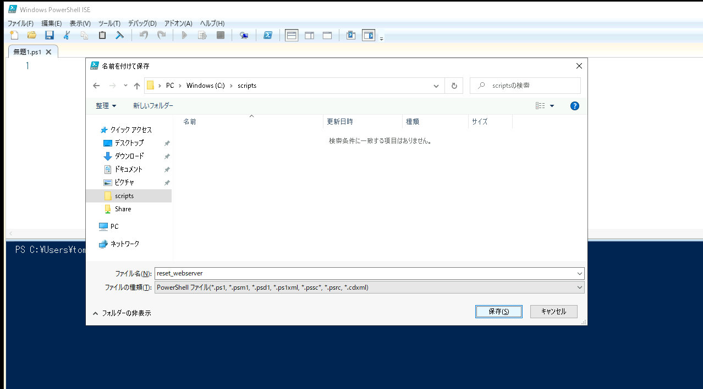</kbd>  


1. Windows Clientでスクリプトファイル(ps1)を記述する   

    1. Windows PowerShell ISEのエディタ画面で、以下のスクリプトを記述する     


        ```
            if(Test-Path "\\Linux1.example.local\share\notify.txt")
            {
                $Credential = New-Object System.Management.Automation.PSCredential('spike', (ConvertTo-SecureString –String 'Pa$$w0rd' –AsPlainText -Force))
                Invoke-Command -ComputerName web1.example.local -ScriptBlock {iisreset} -Credential $Credential
            }

        ```

        <kbd>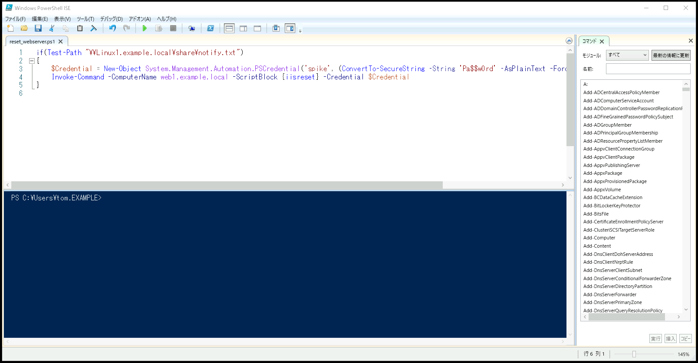</kbd>

        > 【補足】  
        > コマンドの手入力が難しい場合は、コピー&貼りつけで作業を進めてください。  
        > [Ctrl] + [Alt] + [Shift] でクリップボードを編集し、右クリックでLinuxコマンドラインに文字列を貼りつけできます。 

        > 【補足】  
        > if(Test-Path)はファイルの存在有無をチェックして、指定された名前のファイルが存在する場合に限り{}ブロックの処理を実行します。  
        > つまり、Linux1のShareフォルダ内の保存されたnotify.txtファイルが存在する場合に限り、波カッコ{}内の処理を開始します。
        > なお、notifyファイルは、WebサーバーDown時にRouter1のEEMが送信するHTTPメッセージにより作成されます。   
        > 
        > "\$Credential =" 行の記述は、管理者アカウント(EXAMPLE\\Spike)のユーザー名とパスワードを Credential 変数に保存しています。  
        > なお、スクリプトファイル内にパスワードを直接記述することは、セキュリティとしては好ましい実装ではありません。  
        > 
        > Invoke-Command は、リモートコンピューターにコマンドを送信します。   
        > iisresetはIISのサービスを再起動するコマンドです。   


1. スクリプトファイル(ps1)の動作を確認する     

    1. Windows PowerShellを起動する  

    1. PowerShellでps1ファイル名を入力してスクリプトを実行しても、何も処理が行われないことを確認する  
        ＞ ***C:\scripts\reset_webserver.ps1***

        <kbd>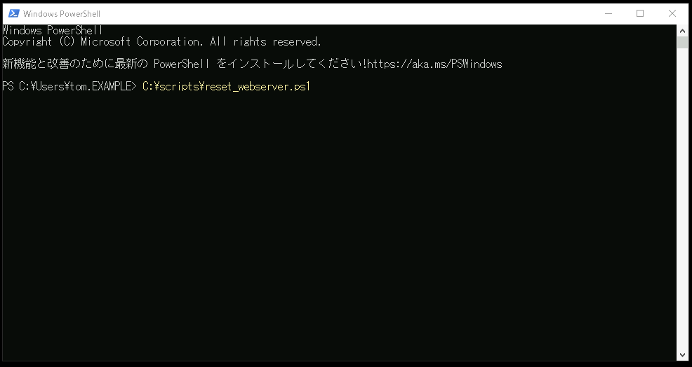</kbd>

        <kbd></kbd>

        > 【補足】  
        > Linux1のShareフォルダ内にnotify.txtファイルが存在しないため、何も処理は実行されません。
 

    1. Linux1のShareフォルダ内にnotify.txtファイルを作成する  
        
       <kbd>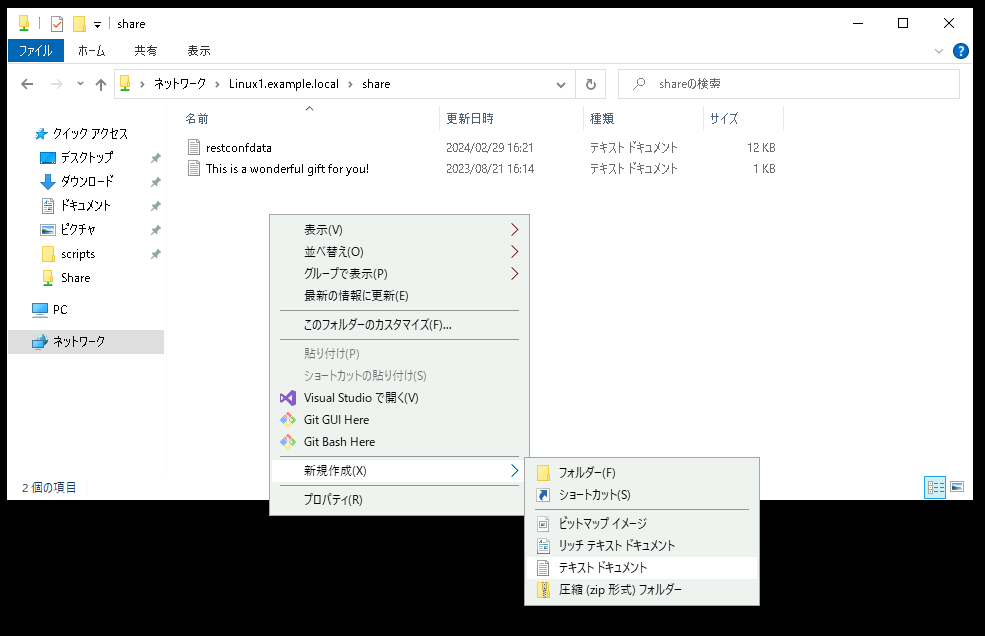</kbd>

       <kbd>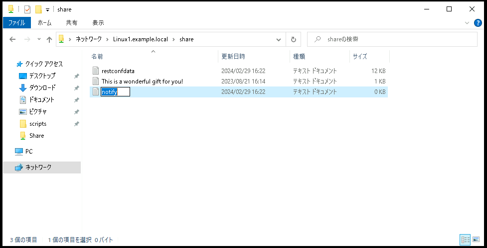</kbd>

    1. PowerShellでps1ファイル名を入力してスクリプトを実行すると、Windows Server 2でIISの再起動されることを確認する     
        ＞ ***C:\scripts\reset_webserver.ps1***

        <kbd></kbd>

        > 【補足】  
        > Linux1のShareフォルダ内にnotify.txtファイルが存在するため、iisresetが実行されます。   


    1. 動作確認のために作成したnotify.txtファイルを削除する  
        
       <kbd>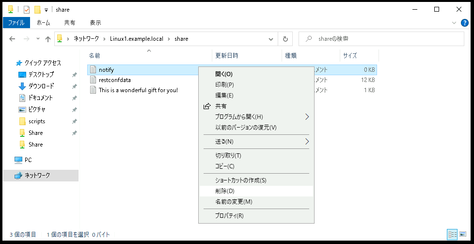</kbd>


---  


# Windows Clientでタスクスケジューラを構成する   

1. [Windowsスタートメニュー]-[Windows管理ツール]-[タスクスケジューラ]をクリックする  

    <kbd>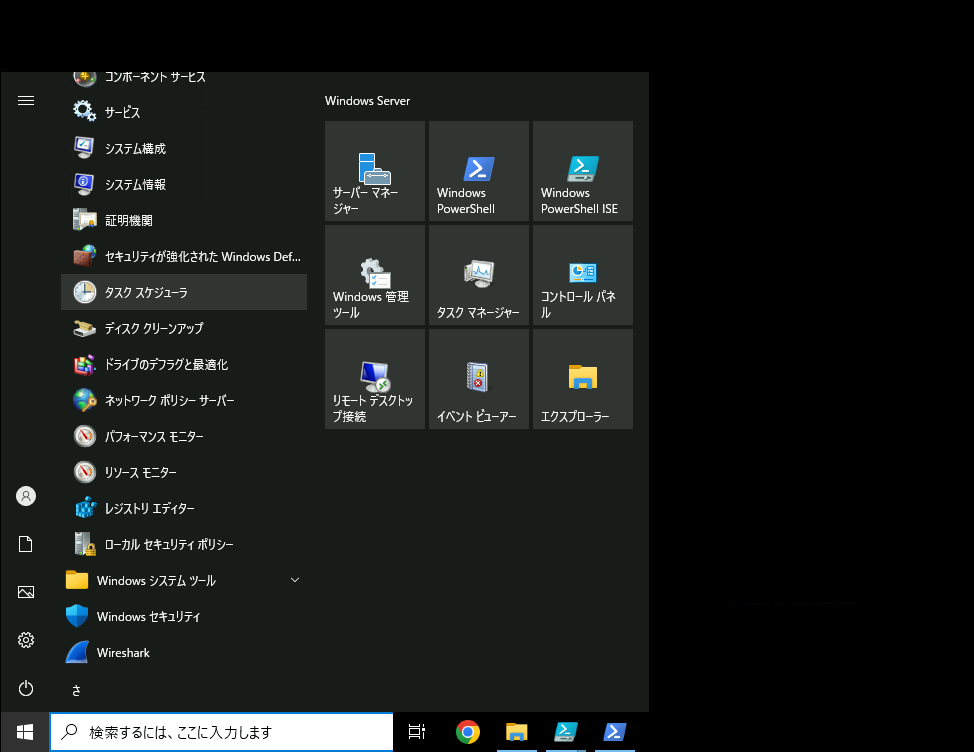</kbd>

1. [タスク スケジューラ(ローカル)]-[タスク スケジューラ ライブラリ]をクリックし、右クリックのコンテキストメニューの[タスクの作成]をクリックする  
    <kbd>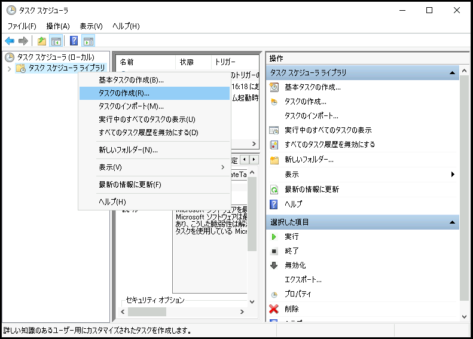</kbd>

1. [タスクの作成]ウィンドウが表示されたことを確認する  
    <kbd>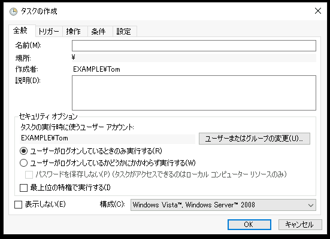</kbd>

1. [タスクの作成]ウィンドウの[全般]タブで、以下のパラメータを入力する  
    | 項目 | パラメータ |
    | :----- | :----- |
    | 名前 | Monitor_WebServer |
    | 場所 | \\ |
    | 作成者 | EXAMPLE\Tom |
    | 説明 | <空欄> |
    
    セキュリティ オプション:
    タスクの実行時に使うユーザーアカウント
    `EXAMPLE\Tom`
    - [ ] ユーザーがログインしているときのみ実行する  
    - [x] ユーザーがログインしているかどうかにかかわらず実行する  
        - [ ] パスワードを保存しない (タスクがアクセスできるのはローカル コンピューター リソースのみ)  
    - [ ] 最上位の特権で実行する  

    - [ ] 表示しない
    構成:`Windows Vista, Windows Server 2008 `

    <kbd>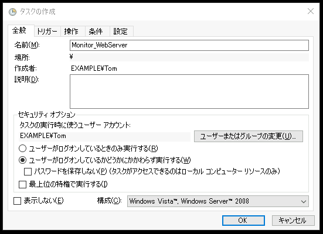</kbd>

1. [タスクの作成]ウィンドウの[操作]タブで、[新規]をクリックする  
    <kbd></kbd>

1. [新しい操作]ウィンドウで、以下のパラメータを入力する  

    操作 : `プログラムの開始`  

    設定 : 
    | 項目 | パラメータ |
    | :----- | :----- |
    | プログラム/スクリプト | powershell |
    | 引数の追加(オプション) | .\reset_webserver.ps1 |
    | 開始(オプション) | C:\scripts |

    <kbd>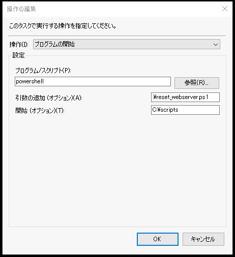</kbd>

1. [新しい操作]ウィンドウで、[OK]をクリックする  

1. [タスクの作成]ウィンドウの[操作]タブで、新しい操作が登録されていることを確認する  

    <kbd></kbd>

1. [タスクの作成]ウィンドウの[トリガー]タブで、[新規]をクリックする  
    <kbd>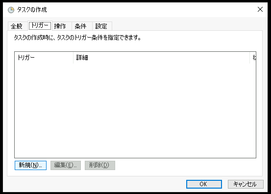</kbd>

1. [新しいトリガー]ウィンドウで、以下のパラメータを入力する  

    タスクの開始 : `スケジュールに従う`
    設定:
    - [ ] 1回
    - [x] <mark>毎日</mark>
    - [ ] 毎週
    - [ ] 毎月

    開始:
    `yyyy/MM/dd`  `HH:mm:ss`   演習作業時点から数分後の日付時刻を設定する  
    - [ ] タイムゾーン間で同期  

    間隔: `1`日

    詳細設定:
    - [ ] 遅延時間を指定する(ランダム)
    - [ ] 繰り返し間隔
    - [ ] 停止するまでの時間
    - [ ] 有効期限
    - [x] 有効

    <kbd></kbd>

    > 【補足】
    > 開始の時刻は後からでも変更できます。  
    > 動作確認のタイミングに合わせて修正してください。  


1. [新しいトリガー]ウィンドウで、[OK]をクリックする  

1. [タスクの作成]ウィンドウの[トリガー]タブで、新しいトリガーが登録されていることを確認する  

    <kbd></kbd>


1. [タスクの作成]ウィンドウで、[OK]をクリックする  

1. タスクを実行するユーザー アカウント情報を入力するポップアップが表示されることを確認する  
1. ユーザー アカウント情報として、EXAMPLE\Tomの情報を入力する

    ユーザー名: `EXAMPLE\Tom`
    パスワード: `Pa$$w0rd`

    <kbd>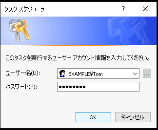</kbd>

<!--
【補足】
ユーザーがログインしているかどうかにかかわらず実行する のチェックを有効化している場合、
タスクの実行時に利用するユーザーアカウントの認証情報を入力する必要があります。
-->

<!--
【補足】
一度作成したタスクを後から編集する場合は、最後のユーザーアカウントの入力形式に特に注意が必要です。  
既定値として入力されているユーザー名にはドメイン名が指定されていません。そのため、ローカルユーザーとして認識されます。
したがって、"Tom"では正しくタスクが動作しません(バッチジョブログオンの権限について警告が表示されます)
"EXAMPLE\Tom"と入力してください。
なお、タスクの初回作成時はユーザー名の既定値が正しく"EXAMPLE\Tom"になっています。  
-->

1. [タスク スケジューラ(ローカル)]-[タスク スケジューラ ライブラリ]に新しいタスクが登録されていることを確認する    
    <kbd>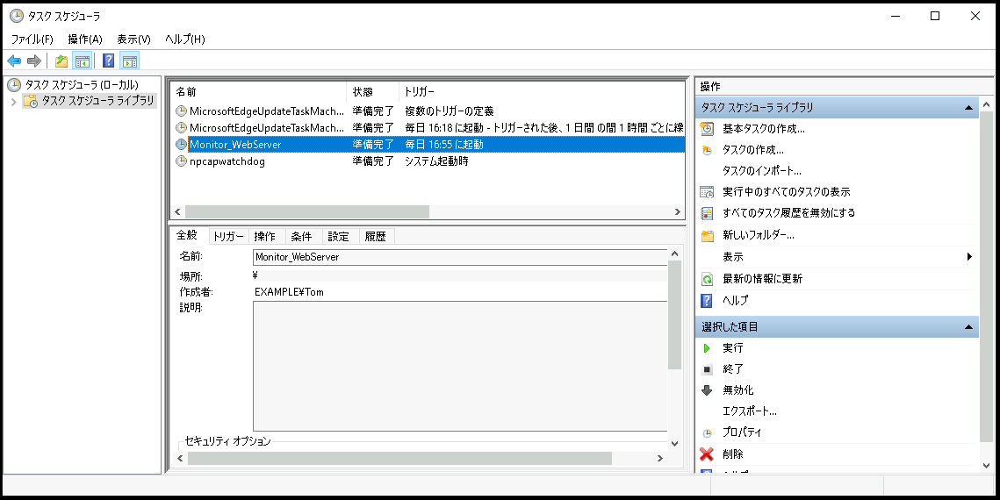</kbd>


---  


# 動作確認

1. Router1(CSR1)のログ出力を有効化する  
    1. Router1(CSR1)に接続する  
    1. Router1(CSR1)で以下のコマンドを実行し、EEMが生成するSyslogメッセージを表示させる        
        CSR1# ***terminal monitor***  

        ```
        CSR1#terminal monitor
        CSR1#
        ```

1. Windows Server 2のWebサービスを停止する    
    1. Windows Server 2(WinSrv2)に接続する  
    1. IIS管理コンソールを起動する  
    1. [サーバー名]を右クリックし、[停止]をクリックする  
        <kbd>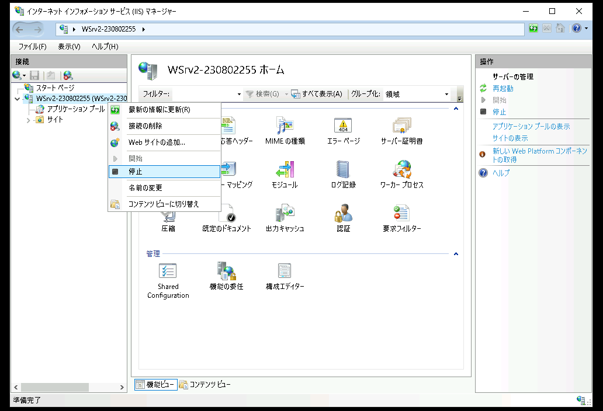</kbd>

    1. IIS管理コンソールの画面を更新するため、手元のキーボードの[F5]キーを押下する  

        > 【補足】  
        > F5キーを正常に入力できない場合は、IIS管理コンソールを一度終了して再度起動させてください。  

    1. すべてのWebサイトが停止していることを確認する    
        <kbd>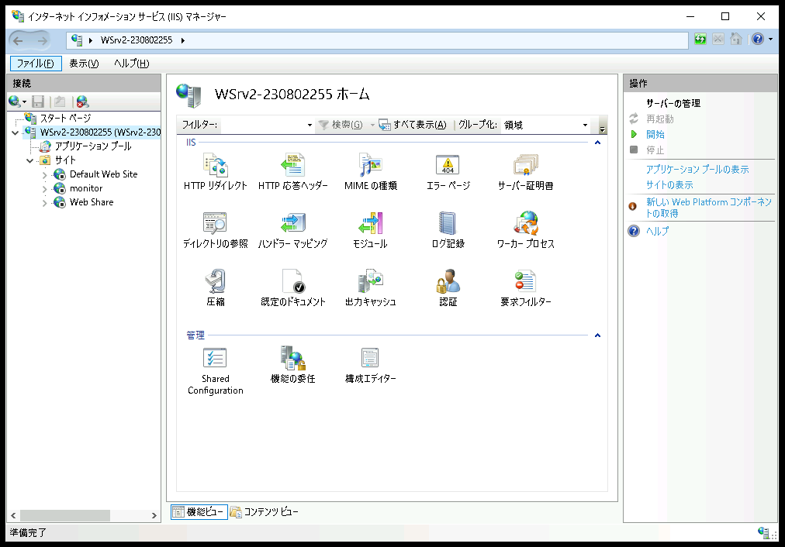</kbd>

        > 【補足】  
        > サイト名の行頭についている青い丸形アイコンに、四角（■）の停止マークが付与されていることを確認する。  

    1. Webブラウザを起動し、monitorサイトに接続してWebサイトが停止していることを確認する  

        | URL | `http://10.X.2.105:8080/` |
        | :----- | :----- |

        <kbd></kbd>

        > 【補足】  
        > Webブラウザのキャッシュ機能により、Webサイトが停止していても意図せずWebページが表示されてしまう場合があります。  
        > Webブラウザの画面更新(F5キー)やキャッシュ削除をお試しください。  


1. Router1(CSR1)のEEMが起動したことを確認する    
    1. Router1(CSR1)に接続する  
    1. IP SLAがWebサイトの停止を検知するまで待機する(最大60秒)
    1. Router1のコンソールに、EEMのSyslogメッセージが出力されたことを確認する  

        ```
        CSR1#
        *Mar  1 07:43:44.166: %TRACK-6-STATE: 10 ip sla 1 reachability Up -> Down
        *Mar  1 07:43:44.167: %HA_EM-6-LOG: MONITORWEB: web server is down
        CSR1#
        ```

1. Linux1にnotifyファイルが作成されたことを確認する     
    1. Linux1(Linux1)に接続する  
    1. Linux1で以下のコマンドを実行し、/shareにnotify.txtが作成されていることを確認する  
        ＞ ***ls /share/***

        ```
        [admin@linux1 ~]$ ls /share/
        notify.txt  restconfdata.txt  This is a wonderful gift for you!.txt
        [admin@linux1 ~]$ 
        ```

1. Windows Client(WinClient)のタスクスケジューラが起動したことを確認する  
    1. Windows Client(WinClient)に "AD Tom" で接続する  
    1. タスクスケジューラが予定した時刻になるまで待機する  

        > 【補足】  
        > タスクスケジューラの実行時刻を変更することもできます。  
        > 作成されているタスクを右クリックし、[プロパティ]からタスク内容を編集してください。  
        > なお、変更を保存する際にユーザーアカウントの入力が求められますが、その際は既定の "Tom" ではなく "EXAMPLE\Tom" と入力してください。  

    1. タスクが実行されたことを確認する  
        <kbd></kbd>

        > 【確認ポイント】  
        > "前回の実行結果" が "この操作を正しく終了しました。(0x0)" であることを確認する。      

        > 【補足】  
        > タスクスケジューラの管理コンソールの画面が更新されない場合は、F5キーを押下するか、管理コンソールを再起動してください。  


1. Windows Server 2のWebサービスが自動的に再起動されていることを各印する     
    1. Windows Server 2(WinSrv2)に接続する  
    1. IIS管理コンソールを起動する  

    1. すべてのWebサイトが起動していることを確認する    
        <kbd></kbd>

        > 【補足】
        > [F5]キーでIIS管理コンソールの画面を更新できます。  

    1. Webブラウザを起動し、monitorサイトに接続して、Webサイトが起動していることを確認する  

        | URL | `http://10.X.2.105:8080/` |
        | :----- | :----- |

        <kbd></kbd>


---  

# 演習完了  
ここまでの手順で、以下の項目を学習できました。  
- [x] Cisco IOS-XEでRESTCONFを有効化する     
- [x] Cisco IOS-XEで、IP SLA、Track、EEMを構成する
- [x] Linuxで、cronを構成する    
- [x] Windows でPowerShellを作成する    
- [x] Windows OSのリモート制御を有効化する  
- [x] Windows OSのタスクスケジューラを構成する  


